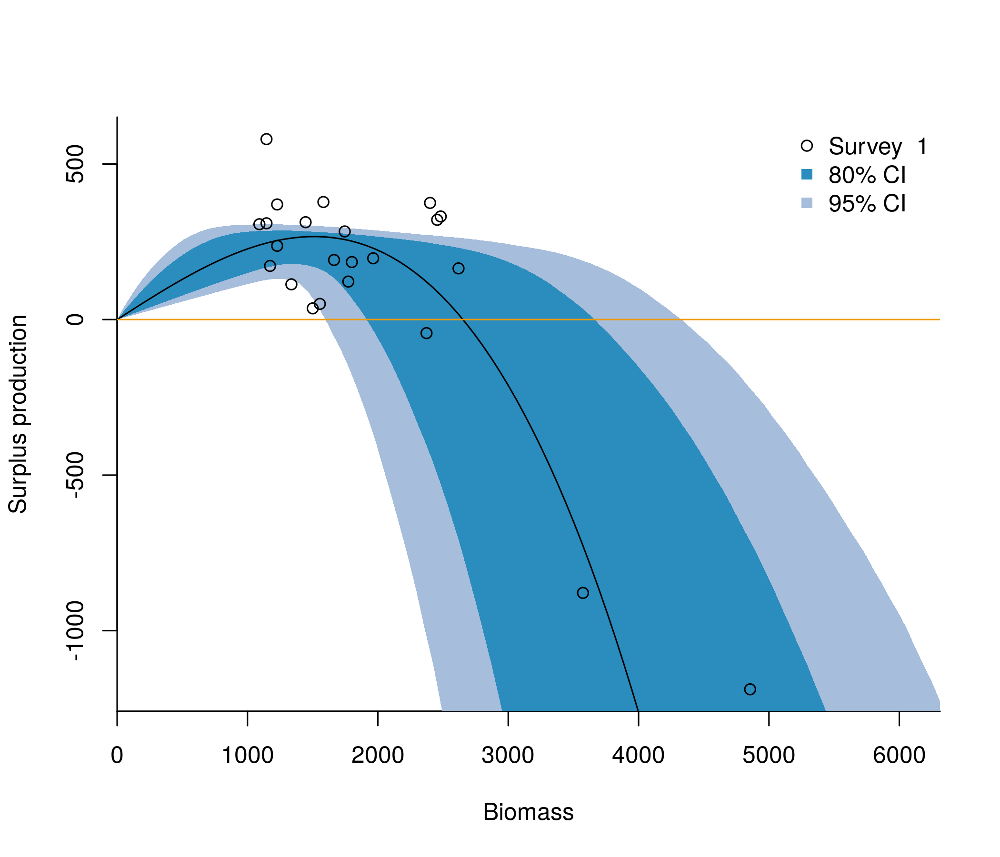

# sundry-R
Various R functions

## sp_uncertainty()
Plots uncertainty of a spict-estimated production curve by sampling from the joint posterior distribution of the parameters. Cóilín Minto and Paul Bouch.

 
```R
library(mvtnorm)
library(spict)
source("sp_uncertainty.R")
data(pol)
rep <- fit.spict(pol$hake)
plot_production(rep)
```

